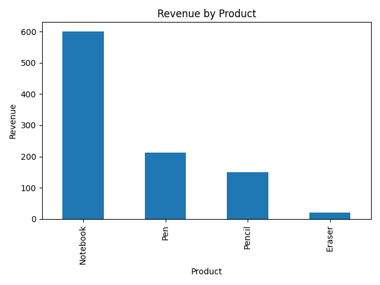

## Task 7 — Basic Sales Summary from SQLite using Python 

### Quick checklist 

+ Windows (open PowerShell or Command Prompt):
  + Check Python: python --version
  + Install packages (if needed): pip install pandas matplotlib

### Step 1 — Create the SQLite database 

Use Python : This will create sales_data.db and add sample rows.

### Step 2 — Python script to read data, run SQL, and plot

+ Create a file named sales_summary.py. It connects to sales_data.db, runs a SQL GROUP BY query, prints the result, and saves a bar chart image (sales_chart.png).

### Step 3— How to run 

1) First create the database (run create_db.py):

2) Then run the summary script:
After running you should see:
- The printed table in the terminal.
- A file named sales_chart.png in the same folder (open it to view the bar chart).

### create_db.py 
```python
# create_db.py
# Run this once to create a sample SQLite database (sales_data.db) with example data.
import sqlite3

conn = sqlite3.connect("sales_data.db")
cur = conn.cursor()

# Create table
cur.execute("""
CREATE TABLE IF NOT EXISTS sales (
    id INTEGER PRIMARY KEY AUTOINCREMENT,
    sale_date TEXT,
    product TEXT,
    quantity INTEGER,
    price REAL
)
""")

# Insert sample rows
sample_data = [
    ("2025-09-01", "Pen", 10, 2.5),
    ("2025-09-02", "Notebook", 5, 15.0),
    ("2025-09-02", "Pen", 7, 2.5),
    ("2025-09-03", "Pencil", 20, 1.0),
    ("2025-09-04", "Notebook", 3, 15.0),
    ("2025-09-05", "Pencil", 10, 1.0),
    ("2025-09-06", "Eraser", 8, 0.5),
]
cur.executemany("INSERT INTO sales (sale_date, product, quantity, price) VALUES (?, ?, ?, ?)", sample_data)

conn.commit()
conn.close()
print("Created sales_data.db with sample data.")
```
### sales_summary.py 

```py
# sales_summary.py
# Run this to connect to sales_data.db, query sales summary, print results, and save a bar chart.
import sqlite3
import pandas as pd
import matplotlib.pyplot as plt

# 1) Connect to the database
conn = sqlite3.connect("sales_data.db")

# 2) SQL query: total quantity and revenue by product
query = """
SELECT product,
       SUM(quantity) AS total_qty,
       SUM(quantity * price) AS revenue
FROM sales
GROUP BY product
ORDER BY revenue DESC
"""

# 3) Load into pandas DataFrame
df = pd.read_sql_query(query, conn)

# 4) Print the table to the screen
print("Sales summary by product:")
print(df.to_string(index=False))

# 5) Plot a simple bar chart of revenue by product
ax = df.plot(kind='bar', x='product', y='revenue', legend=False)
ax.set_ylabel("Revenue")
ax.set_xlabel("Product")
ax.set_title("Revenue by Product")
plt.tight_layout()
plt.savefig("sales_chart.png")
print("Saved chart to sales_chart.png")

# 6) Close connection
conn.close()

```

### sales chart


